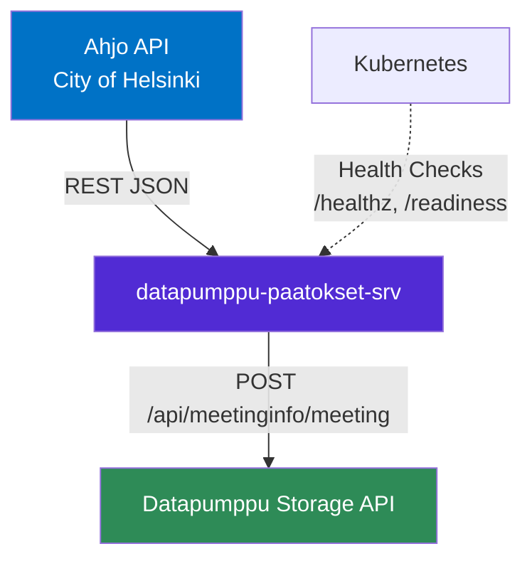
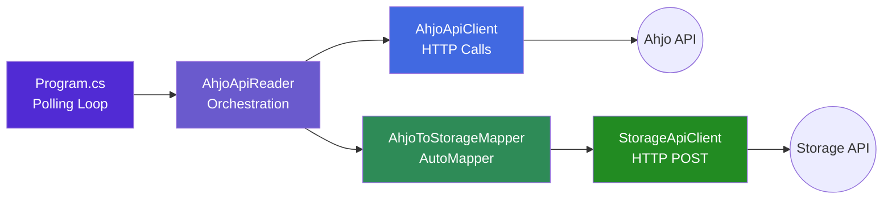

# datapumppu-paatokset-srv


A background polling service that fetches municipal meeting, agenda, and decision data from the City of Helsinki **Ahjo API**, transforms it into a unified format, and pushes it to the **Datapumppu Storage API**.

## Table of Contents

- [datapumppu-paatokset-srv](#datapumppu-paatokset-srv)
  - [Table of Contents](#table-of-contents)
  - [About](#about)
  - [Key Features](#key-features)
  - [Architecture](#architecture)
    - [System Context](#system-context)
    - [Internal Architecture](#internal-architecture)
  - [Built With](#built-with)
  - [Prerequisites](#prerequisites)
  - [Getting Started](#getting-started)
    - [Installation](#installation)
    - [Configuration](#configuration)
    - [Running Locally](#running-locally)
    - [Docker Setup](#docker-setup)
  - [Deployment](#deployment)
    - [Dev/test environment](#devtest-environment)
    - [Staging/Production environment](#stagingproduction-environment)
    - [CI/CD Pipeline](#cicd-pipeline)
    - [Health Monitoring](#health-monitoring)
  - [Development](#development)
    - [Project Structure](#project-structure)
    - [Code Documentation](#code-documentation)
    - [Testing](#testing)

## About

The **datapumppu-paatokset-srv** (AhjoApiService) is a .NET 6 background polling microservice within the **Datapumppu ecosystem**. It continuously synchronises meeting data from the City of Helsinki's Ahjo decision-making system into the shared Datapumppu storage layer.

This service handles:
- **Meeting Data Polling** — Periodically queries the Ahjo API for meetings across a rolling 7-day time window, advancing through future dates and cycling back after 3 months.
- **Data Transformation** — Maps Ahjo-specific DTOs to a normalised storage format using AutoMapper, including language extraction from PDF metadata and attachment title truncation.
- **Storage Persistence** — Posts each transformed meeting (with its agendas or decisions) as JSON to the Datapumppu Storage API via HTTP.

## Key Features

**Continuous Background Polling** — Infinite loop polls the Ahjo API every 60 minutes with a 7-day sliding window, automatically resetting after a 3-month lookahead.  
**Minutes-Aware Branching** — When meeting minutes are published, the service fetches approved decisions and clears draft agenda data; otherwise it fetches full agenda items.  
**AutoMapper Transformation Pipeline** — Declarative mapping from Ahjo DTOs to Storage DTOs with custom value resolvers (title truncation to 256 chars, language extraction from PDF attachment metadata).  
**Graceful Error Handling** — API and storage failures are logged but never crash the service; partial data is accepted and the polling loop continues.  
**Health Check Endpoints** — Exposes `/healthz` and `/readiness` for Kubernetes liveness and readiness probes.  

## Architecture

### System Context

The datapumppu-paatokset-srv is one microservice within the larger **Datapumppu ecosystem**. It integrates with external systems as shown below:



### Internal Architecture

The service follows a **pipeline** pattern — poll → orchestrate → map → post:



**Layer Responsibilities:**

- **Program.cs** (`AhjoApiService/Program.cs`) — Application entry point. Configures DI, health checks, and runs the infinite polling loop (60 min interval, 7-day window, 3-month reset).
- **AhjoApiReader** (`AhjoApiService/AhjoApi/AhjoApiReader.cs`) — Orchestrates data collection for a date range. For each meeting, decides whether to fetch full agenda (draft) or approved decisions (minutes published).
- **AhjoApiClient** (`AhjoApiService/AhjoApi/AhjoApiClient.cs`) — HTTP client for the Ahjo API. Handles meetings, meeting details, agenda items, decisions, and decision details endpoints.
- **AhjoToStorageMapper** (`AhjoApiService/AhjoToStorageMapper.cs`) — Transforms `AhjoMeetingData` into `StorageMeetingDTO` using AutoMapper. Truncates titles to 256 chars and extracts language from PDF metadata.
- **StorageApiClient** (`AhjoApiService/StorageClient/StorageApiClient.cs`) — Posts each `StorageMeetingDTO` as JSON to the Storage API's `POST /api/meetinginfo/meeting` endpoint.

## Built With

| Technology | Version | Purpose |
|------------|---------|---------|
| [.NET](https://dotnet.microsoft.com/) | 6.0 | Runtime and web framework (ASP.NET Core) |
| [AutoMapper](https://automapper.org/) | 12.0.0 | Declarative object-to-object mapping |
| [Newtonsoft.Json](https://www.newtonsoft.com/json) | 13.0.2 | JSON serialisation/deserialisation |
| [Azure.Extensions.AspNetCore.Configuration.Secrets](https://learn.microsoft.com/en-us/dotnet/api/overview/azure/extensions.aspnetcore.configuration.secrets-readme) | 1.2.2 | Azure Key Vault configuration provider |
| [xUnit](https://xunit.net/) | 2.4.1 | Unit testing framework |
| [Moq](https://github.com/moq/moq4) | 4.18.2 | Mocking library for unit tests |

## Prerequisites

Before you begin, ensure you have the following installed:

- **[.NET 6.0 SDK](https://dotnet.microsoft.com/en-us/download/dotnet/6.0)** — Required to build and run the service.
- **[Docker](https://www.docker.com/)** — Required for containerised builds and deployments.
- **[kubectl](https://kubernetes.io/docs/tasks/tools/)** — Required to deploy to a Kubernetes cluster.
- **Ahjo API Key** — Obtain from the City of Helsinki. Required to authenticate with the Ahjo API.

**Recommended IDEs:**
- Visual Studio 2022
- Visual Studio Code with C# Dev Kit

## Getting Started

### Installation

1. **Clone the repository:**
   ```bash
   git clone <repository-url>
   cd datapumppu-paatokset-srv
   ```

2. **Restore dependencies:**
   ```bash
   dotnet restore
   ```

### Configuration

Configure the application using environment variables, user secrets, or `appsettings.Development.json`:

| Variable | Description | Example |
|----------|-------------|---------|
| `AHJO_API_KEY` | API key for authenticating with the Ahjo API | *(stored in user secrets or K8s secret)* |
| `AHJO_API_URL` | Base URL for the Ahjo API proxy | `https://nginx-paatokset-test.agw.arodevtest.hel.fi/en/ahjo-proxy/` |
| `STORAGE_URL` | Base URL for the Datapumppu Storage API | `http://localhost:5154` |

**Set the API key via user secrets (local development):**
```bash
cd AhjoApiService
dotnet user-secrets set "AHJO_API_KEY" "<your-api-key>"
```

**Example `appsettings.Development.json`:**
```json
{
    "Logging": {
        "LogLevel": {
            "Default": "Information",
            "Microsoft.AspNetCore": "Warning"
        }
    },
    "STORAGE_URL": "http://localhost:5154",
    "AHJO_API_URL": "https://nginx-paatokset-test.agw.arodevtest.hel.fi/en/ahjo-proxy/"
}
```

### Running Locally

1. **Ensure the Storage API is running** (default: `http://localhost:5154`).

2. **Run the application:**
   ```bash
   cd AhjoApiService
   dotnet run
   ```

The application will start on `http://localhost:5156` by default.

**Verify the application is running:**
```bash
curl http://localhost:5156/healthz
# Expected: Healthy
```

> **Note:** On startup the service immediately begins polling the Ahjo API. Ensure a valid `AHJO_API_KEY` is configured, otherwise all poll cycles will log errors and return empty data.

### Docker Setup

**Build Docker image:**
```bash
docker build -t ahjoapiservice:latest .
```

**Run container:**
```bash
docker run -d \
  --name ahjoapiservice \
  -p 8080:8080 \
  -e AHJO_API_KEY="<your-api-key>" \
  -e AHJO_API_URL="https://nginx-paatokset-test.agw.arodevtest.hel.fi/en/ahjo-proxy/" \
  -e STORAGE_URL="http://host.docker.internal:5154" \
  ahjoapiservice:latest
```

> **Tip:** Use `host.docker.internal` to reach services running on the host machine from inside the Docker container.

## Deployment

### Dev/test environment

Open a PR and target the **develop** branch. Once the branch gets merged, Azure pipelines will take care of deployment.

### Staging/Production environment

Open a PR from **develop** and target the **master** branch. Once the branch gets merged, Azure pipelines will take care of deployment.

**Deployment Details:**

| Property | Value |
|----------|-------|
| Replicas | 1 |
| Container Image | `acrdatapumppudevwesteurope.azurecr.io/ahjoapiservice:latest` |
| CPU Requests / Limits | 100m / 250m |
| Memory Requests / Limits | 128Mi / 256Mi |
| Container Port | 80 |
| Namespace | `datapumppu` |

**Environment Variables from K8s Resources:**

| Env Var | Source | Key |
|---------|--------|-----|
| `AhjoApi__api-key` | Secret `ahjoapiservice-secret` | `AhjoApiKey` |
| `AhjoApi__url` | ConfigMap `ahjoapiservice-configmap` | `AhjoApiUrl` |
| `Storage__url` | ConfigMap `ahjoapiservice-configmap` | `StorageUrl` |

### CI/CD Pipeline

The project uses **Azure Pipelines** for continuous integration and deployment:

- **Development Branch:** [azure-pipelines-build-develop.yml](azure-pipelines-build-develop.yml) — Triggers on push to `develop` (batched). Uses the `Default` agent pool. Extends a shared template from the `datapumppu-pipelines` repository.
- **Production Branch:** [azure-pipelines-build-master.yml](azure-pipelines-build-master.yml) — Triggers on push to `master` (batched). Uses the `Production` agent pool. Extends a shared template from the `datapumppu-pipelines` repository.

Both pipelines exclude `README.md` changes from triggering builds and have PR validation disabled.

### Health Monitoring

The application exposes health check endpoints for Kubernetes probes:

| Endpoint | Type | Purpose |
|----------|------|---------|
| `/healthz` | Liveness | Confirms the application process is running. Restarts the pod if unhealthy. |
| `/readiness` | Readiness | Confirms the application is ready to handle requests. Routes traffic only when ready. |

**Kubernetes Health Check Configuration:**
```yaml
livenessProbe:
  httpGet:
    path: /healthz
    port: 80
  initialDelaySeconds: 10
  periodSeconds: 10

readinessProbe:
  httpGet:
    path: /readiness
    port: 80
  initialDelaySeconds: 5
  periodSeconds: 5
```

## Development

### Project Structure

```
datapumppu-paatokset-srv/
├── AhjoApiService/
│   ├── AhjoApi/                    # Ahjo API integration layer
│   │   ├── DTOs/                   # Data transfer objects for Ahjo API responses
│   │   ├── Models/                 # Internal domain models (AhjoMeetingData)
│   │   ├── IAhjoApiClient.cs       # Interface for Ahjo API HTTP operations
│   │   ├── AhjoApiClient.cs        # HTTP client implementation for Ahjo API
│   │   ├── AhjoApiConnection.cs    # HTTP connection factory with API key auth
│   │   └── AhjoApiReader.cs        # Orchestrator: fetches and composes meeting data
│   ├── StorageClient/              # Storage API integration layer
│   │   ├── DTOs/                   # Data transfer objects for Storage API payloads
│   │   ├── Storage.cs              # Storage abstraction with error handling
│   │   ├── StorageApiClient.cs     # HTTP client for posting meetings to Storage API
│   │   ├── StorageConnection.cs    # HTTP connection factory for Storage API
│   │   └── MeetingComparer.cs      # Reflection-based meeting equality comparer
│   ├── AhjoToStorageMapper.cs      # AutoMapper configuration: Ahjo DTOs → Storage DTOs
│   ├── Program.cs                  # Entry point, DI setup, polling loop
│   └── AhjoApiService.csproj       # Project file (.NET 6.0)
├── AhjoApiServiceUnitTests/        # Unit tests (xUnit + Moq)
│   ├── AhjoApi/                    # Tests for API client and reader
│   ├── StorageClient/              # Tests for storage client and comparer
│   └── AhjoToStorageMapperTests.cs # Tests for mapping logic
├── k8s/                            # Kubernetes deployment manifests
│   ├── ahjoapiservice-configmap.yml
│   ├── ahjoapiservice-deploy.yml
│   └── ahjoapiservice-secret.yml
├── Dockerfile                      # Multi-stage Docker build
├── azure-pipelines-build-develop.yml
├── azure-pipelines-build-master.yml
└── AhjoApiService.sln              # Solution file
```

### Code Documentation

All public and internal types, interfaces, methods, and properties include **XML documentation comments** (`///`) following C# standards. This enables IntelliSense tooltips and can be used for automated documentation generation.

### Testing

**Unit Tests:** Located in [AhjoApiServiceUnitTests/](AhjoApiServiceUnitTests/)

| Test Class | What It Tests |
|------------|---------------|
| `AhjoToStorageMapperTests` | AutoMapper configuration: verifies agenda item and meeting DTO field mapping, including language extraction from PDF metadata |
| `AhjoApiClientTests` | HTTP client: verifies meeting, agenda, and decision fetching with mocked HTTP handlers; checks correct endpoint URLs and call counts |
| `AhjoApiReaderTests` | Orchestration: verifies `GetMeetingsData()` correctly composes `AhjoMeetingData` from mocked API client responses |
| `StorageTests` | Storage wrapper: verifies delegation to `IStorageApiClient` and that exceptions are caught without rethrowing |
| `StorageApiClientTests` | HTTP posting: verifies POST to `/api/meetinginfo/meeting`, failure handling (returns `false`), and correct call counts for multiple meetings |
| `MeetingComparerTests` | Equality comparison: verifies same/different meeting ID comparison via reflection |

**Run Tests:**
```bash
# Run all tests
dotnet test

# Run tests with coverage
dotnet test /p:CollectCoverage=true

# Run a specific test class
dotnet test --filter "FullyQualifiedName~AhjoApiClientTests"
```

---

**Last Updated:** 20.03.2026
